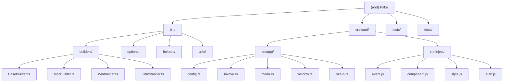

# CLAUDE.md

This file provides guidance to Claude Code (claude.ai/code) when working with code in this repository.

> **Important Note**: This file is the single source of truth for any AI Agent (Claude, Gemini, Cursor, etc.) working in this repository, aggregating architectural context, development workflows, and behavior guidelines.

---

## Change Log (Changelog)

### 2026-02-26 16:35:46
- Initial AI context documentation generated
- Added module structure diagram with Mermaid
- Created module-level documentation for key components

---

## 1. Core Philosophy & Standards

### Core Philosophy

- **Progressive over Big Bang**: Break complex tasks into manageable stages
- **Learn Existing Code**: Understand existing patterns before implementing new features
- **Clear Intent Over Clever Code**: Prioritize readability and maintainability
- **Simple Over Complex**: Keep implementations straightforward and problem-focused

### Eight Honors & Eight Shames

- **Honor** serious research; **Shame** guessing at APIs
- **Honor** seeking confirmation; **Shame** vague execution
- **Honor** manual verification; **Shame** assuming business logic
- **Honor** reusing existing interfaces; **Shame** creating new ones
- **Honor** proactive validation; **Shame** skipping tests
- **Honor** following standards; **Shame** breaking architecture
- **Honor** admitting ignorance; **Shame** pretending understanding
- **Honor** careful refactoring; **Shame** blind modifications

### Code Quality Standards

- **English Comments Only**: Chinese comments are strictly prohibited
- **Avoid Unnecessary Comments**: Let simple code be self-documenting
- **Self-Documenting Code**: Use explicit types and clear naming over inline documentation
- **Composition Over Inheritance**: Prefer functional patterns where applicable (Rust)

---

## 2. Project Overview

**Name**: Pake
**Purpose**: One-command tool to convert any webpage into a lightweight desktop application (supports macOS, Windows, Linux)
**Core Value**: ~20x smaller than Electron packages, typically only ~5MB
**Implementation**: Uses Rust and Tauri to wrap web content in system WebView (WebView2 on Windows, WebKit on macOS/Linux)

---

## 3. Tech Stack

- **Core Framework**: [Tauri v2](https://tauri.app/) (Rust)
- **CLI Tool**: TypeScript, Node.js, Commander.js
- **Frontend**: HTML/CSS/JS (injected into WebView)
- **Build Tool**: Rollup (for CLI build)
- **Package Manager**: pnpm
- **Minimum Versions**: Rust >= 1.85, Node >= 22

---

## 4. Repository Architecture

### Directory Structure

```
bin/                    # CLI tool source code
├── cli.ts              # Entry point
├── defaults.ts         # CLI parameter defaults
├── types.ts            # TypeScript type definitions
├── builders/           # Application build logic
│   ├── BaseBuilder.ts  # Builder base class
│   ├── BuilderProvider.ts
│   ├── MacBuilder.ts   # macOS platform build
│   ├── WinBuilder.ts   # Windows platform build
│   └── LinuxBuilder.ts # Linux platform build
├── options/            # CLI parameter handling
│   ├── index.ts        # Parameter parsing entry
│   └── icon.ts         # Icon processing
├── helpers/            # Helper functions
└── utils/              # Utility functions

src-tauri/              # Tauri desktop application
├── src/
│   ├── main.rs         # Rust entry, calls lib.rs
│   ├── lib.rs          # **Core logic**: menu setup, plugin init, app lifecycle
│   ├── util.rs         # Utility functions
│   ├── app/            # Application modules (important!)
│   │   ├── mod.rs      # Module declarations
│   │   ├── config.rs   # App config struct definitions
│   │   ├── invoke.rs   # Tauri invoke command handlers
│   │   ├── menu.rs     # App menu setup (macOS only)
│   │   ├── setup.rs    # Plugin initialization config
│   │   └── window.rs   # Window creation and management
│   └── inject/         # JavaScript injected into target webpages
│       ├── event.js    # Event handling (shortcuts, navigation)
│       ├── component.js # UI component injection
│       ├── style.js    # Style overrides
│       ├── auth.js     # Authentication handling
│       ├── custom.js   # User-editable custom scripts
│       └── theme_refresh.js # Theme detection
├── tauri.conf.json     # Default configuration
├── pake.json           # Capabilities configuration
└── Cargo.toml          # Rust dependency config

dist/                   # Compiled CLI output
tests/                  # Test files
```

### Module Structure Diagram



### Module Index

| Module | Path | Description | Language |
|--------|------|-------------|----------|
| CLI Tool | `bin/` | Command-line interface for building apps | TypeScript |
| Builders | `bin/builders/` | Platform-specific build logic | TypeScript |
| Tauri App | `src-tauri/` | Core desktop application | Rust |
| App Logic | `src-tauri/src/app/` | Application business logic | Rust |
| Inject Scripts | `src-tauri/src/inject/` | Scripts injected into webpages | JavaScript |
| Tests | `tests/` | Test suites | JavaScript |

---

## 5. Core Workflows

### Development Process

1. **Understand**: Study existing patterns in the codebase
2. **Plan**: Break complex work into stages
3. **Test**: Write tests when applicable
4. **Implement**: Smallest viable solution
5. **Refactor**: Optimize and clean up

### Common Commands

```bash
# Install dependencies
pnpm i

# CLI development (watch mode, recompiles TypeScript)
pnpm run cli

# Application development (hot reload)
pnpm run dev

# Build CLI (Rollup compilation)
pnpm run cli:build

# Build application
pnpm run build

# Debug build
pnpm run build:debug

# Run tests (builds CLI first, use PAKE_CREATE_APP=1 env var)
pnpm test

# Code formatting
pnpm run format
```

### Release Process

- CI/CD via GitHub Actions handles releases
- Version managed in `package.json` and `src-tauri/tauri.conf.json`

---

## 6. Implementation Details

### CLI Tool (`bin/`)

- **Parameter Parsing**: Uses `commander` library
- **Builder Selection**: `BuilderProvider` selects correct builder by platform
- **Inheritance**: `BaseBuilder` → `MacBuilder`/`WinBuilder`/`LinuxBuilder`
- **Key Parameters**: `--width`, `--height`, `--icon`, `--inject`, `--hide-title-bar`

### Tauri Application (`src-tauri/`)

#### Module Responsibilities (`src/app/`)

| File | Responsibility |
|------|----------------|
| `config.rs` | Defines `AppConfig`, `WindowConfig` structs, stores app configuration |
| `invoke.rs` | Handles frontend-called Rust commands (download file, send notification) |
| `menu.rs` | Builds app menu (macOS differs from other platforms) |
| `setup.rs` | Initializes Tauri plugins (window-state, oauth, http, etc.) |
| `window.rs` | Creates and manages WebView windows |

#### `lib.rs` Core Functions

- Sets up menu (macOS vs others)
- Configures plugins: `window-state`, `single-instance`, `opener`, `notification`
- Handles custom commands: `download_file`, `send_notification`
- Manages window events (close hides instead of exits)

#### Window Management

- Uses `tauri-plugin-window-state` to remember window size and position
- Supports "launch to tray" and "close to hide"

### Injection System

**Path**: `src-tauri/src/inject/`

**Mechanism**: Tauri injects these scripts at runtime into target webpages

**Functions**:
- Custom CSS overrides
- Keyboard shortcuts (zoom, navigation)
- Platform-specific adjustments

---

## 7. Common AI Tasks

### Adding CLI Parameters

1. Update `bin/types.ts` (interface definition `PakeCliOptions`)
2. Update `bin/defaults.ts` (default values)
3. Update `bin/cli.ts` (Commander option definitions)
4. Update `bin/options/index.ts` (parameter processing logic)
5. If passing to Rust, update `src-tauri/src/app/config.rs` (struct definitions)

### Modifying App Menu

Edit `src-tauri/src/app/menu.rs`

### Modifying Injection Scripts

Edit `src-tauri/src/inject/event.js` or `component.js`

### Adding New Tauri Commands

1. Define command handler in `src-tauri/src/app/invoke.rs`
2. Register command in `invoke_handler` in `src-tauri/src/lib.rs`
3. Frontend calls via `invoke()`

### Modifying Window Config

1. TypeScript side: `WindowConfig` interface in `bin/types.ts`
2. Rust side: Structs in `src-tauri/src/app/config.rs`
3. App config: Window creation logic in `src-tauri/src/app/window.rs`

---

## 8. Coding Standards

- **English Comments Only**: Prohibited Chinese comments
- **Avoid Unnecessary Comments**: Simple code should be self-explanatory
- **Function Size**: Single responsibility, if >20 lines consider splitting
- **Naming**: Descriptive, self-explanatory names; no abbreviations
- **Comments Explain Why**: Not what

---

## 9. AI Usage Guidelines

1. **Read Before Writing**: Study existing patterns before implementing
2. **Test Before Commit**: Ensure changes work
3. **Document Complex Logic**: Add comments for non-obvious code
4. **Follow Project Structure**: Respect module boundaries
5. **Keep Changes Small**: Incremental improvements

---

## 10. Testing Strategy

- **Location**: `tests/` directory
- **Runner**: Custom test runner in `tests/index.js`
- **Types**: Unit tests, integration tests, E2E tests, release workflow tests
- **Run**: `pnpm test`

---

## 11. References

- [Tauri Documentation](https://tauri.app/)
- [Project README](./README.md)
- [CLI Usage Guide](./docs/cli-usage.md)
- [Advanced Usage](./docs/advanced-usage.md)
